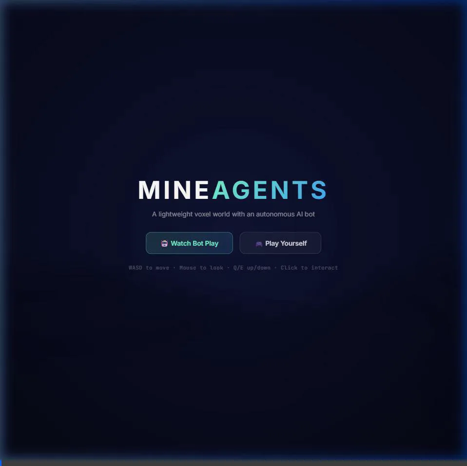

# 🤖 MineAgents

A lightweight browser-based voxel engine with an autonomous AI bot — built with **Three.js** and deployable to **Vercel**.


## ✨ Features

- **🌍 Procedural Voxel World** — Chunk-based terrain with simplex noise, caves, biomes (grass, dirt, stone, snow, sand)
- **🤖 Autonomous AI Bot** — Rule-based agent with cliff detection, obstacle avoidance, and exploration
- **🎮 Dual Mode** — Watch the bot play or take control yourself
- **📊 Live HUD** — Real-time FPS, position, bot action & reasoning
- **⚡ Ultra Lightweight** — Only **123KB gzipped**, runs at 60fps in the browser
- **🚀 Vercel Ready** — One-click deploy


## 🚀 Quick Start

```bash
# Install dependencies
npm install

# Start dev server
npm run dev

# Build for production
npm run build
```

## 🎮 Controls

| Key | Action |
|-----|--------|
| `W A S D` | Move forward / left / back / right |
| `Q / E` | Move up / down |
| `Mouse` | Look around (click to capture) |
| `ESC` | Release mouse |

## 🤖 Bot Behaviors

The autonomous bot uses a **sense → decide → act** loop:

| Behavior | Trigger |
|----------|---------|
| **Cliff avoidance** | No ground ahead → turns away |
| **Obstacle dodge** | Block in path → turns left/right |
| **Boundary clamping** | Near world edge → turns inward |
| **Stuck escape** | No movement detected → jumps/turns |
| **Exploration** | Clear path → moves forward, looks around |

## 🏗️ Architecture

```
src/
├── main.js        # Entry point, scene, game loop
├── world.js       # Chunk-based voxel world + meshing
├── terrain.js     # Procedural generation (simplex noise)
├── bot.js         # Autonomous AI agent
├── controls.js    # First-person pointer-lock controls
├── hud.js         # HUD overlay controller
└── style.css      # Glassmorphism UI styles
```

## 🚀 Deploy to Vercel

```bash
npx vercel
```

Or connect this repo to [Vercel](https://vercel.com) for automatic deploys on push.

## 📦 Tech Stack

- **[Three.js](https://threejs.org/)** — 3D rendering
- **[Vite](https://vitejs.dev/)** — Build tool
- **[simplex-noise](https://github.com/jwagner/simplex-noise.js)** — Terrain generation

## 📖 Walkthrough

### What Was Built

| File | Purpose |
|------|---------|
| `src/main.js` | Entry point — Three.js scene, lighting, fog, and game loop |
| `src/world.js` | Chunk-based voxel world with face-culled mesh generation |
| `src/terrain.js` | Procedural terrain with simplex noise, caves & biomes |
| `src/bot.js` | Autonomous bot with sense → decide → act loop, cliff detection, boundary clamping |
| `src/controls.js` | First-person pointer-lock controls with basic collision |
| `src/hud.js` | DOM-based HUD overlay (FPS, position, bot action & reason) |
| `src/style.css` | Glassmorphism UI styling |
| `vite.config.js` | Vite build config — outputs to `dist/` |
| `vercel.json` | Vercel deployment config (`npm run build` → `dist/`) |

### ✅ Test Results

| Check | Result |
|-------|--------|
| Production build | ✅ **123 KB gzipped** |
| Browser FPS | ✅ ~57 FPS |
| Bot navigation | ✅ Stays on terrain, detects cliffs, avoids void |
| HUD updates | ✅ Real-time FPS, position, action & reason displayed |
| Console errors | ✅ None |

### 🎬 Bot Demo



### 🚀 Deployment Steps

```bash
# 1. Install dependencies
npm install

# 2. Build for production
npm run build        # outputs to dist/

# 3. Deploy via Vercel CLI
npx vercel --prod
```

Or connect your GitHub repo **`Souvik-Ghost/MineAgents`** to [Vercel](https://vercel.com) for **automatic deploys on every push**.

> **Vercel settings are pre-configured** in `vercel.json` — no manual setup needed.

---

## 📖 Walkthrough

Browser-based voxel engine with an autonomous AI bot, built with **Three.js + Vite** and deployable to Vercel.

### What Was Built

| File | Purpose |
|------|---------|
| [src/main.js](src/main.js) | Entry point — scene, lighting, fog, game loop |
| [src/world.js](src/world.js) | Chunk-based voxel world with face-culled mesh generation |
| [src/terrain.js](src/terrain.js) | Procedural terrain with simplex noise, caves, biomes |
| [src/bot.js](src/bot.js) | Autonomous bot with sensing, cliff detection, boundary clamping |
| [src/controls.js](src/controls.js) | First-person pointer-lock controls with collision |
| [src/hud.js](src/hud.js) | DOM-based HUD overlay |
| [src/style.css](src/style.css) | Glassmorphism UI styling |

### Test Results

- ✅ **Build**: Production bundle — **123KB gzipped**
- ✅ **FPS**: ~57 FPS in browser
- ✅ **Bot Navigation**: Stays on terrain, detects cliffs, avoids void
- ✅ **HUD**: Displays action, reason, FPS, position in real-time
- ✅ **No console errors**

## 📄 License

MIT